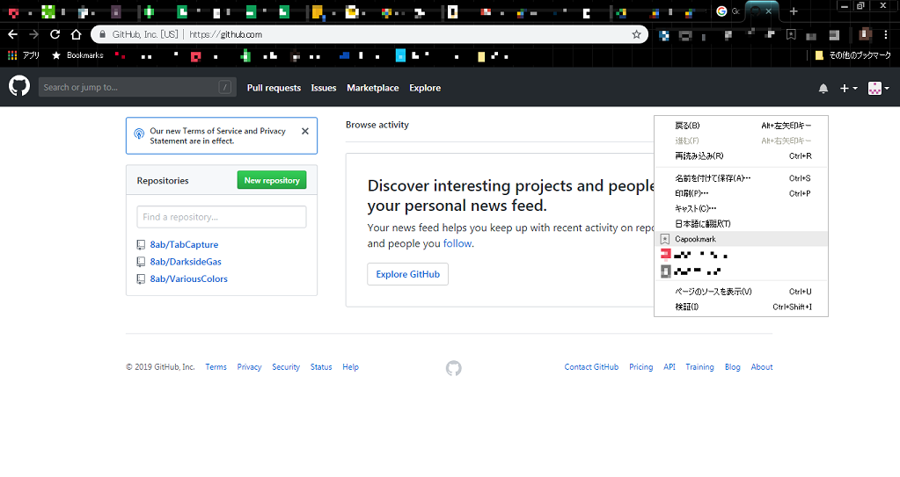
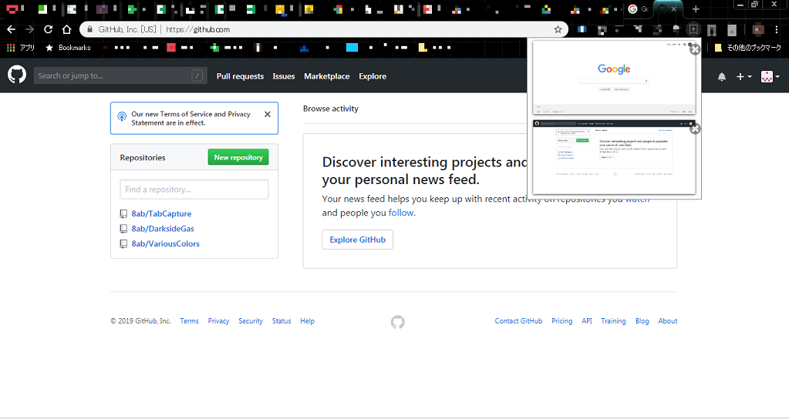
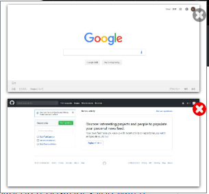

# Capookmark

Webページのキャプチャー画像でブックマークを管理するChrome機能拡張です。

## 使い方

1. ブックマークの追加

ブックマークに追加したいWebページを表示し右クリック→「Capookmark」を選択
（画面に表示されている範囲がキャプチャーされます）

2. ブックマークの表示

Chromeメニュー上の「Capookmark」アイコンクリックでブックマーク（キャプチャー画像）を表示。
キャプチャー画像はキャプチャー元のページへのリンクとなっています。

3. ブックマークの削除

キャプチャー画像右上の×ボタンでブックマークを削除します。

